# 安全模块功能展示报告

**报告时间**: 2026-07-01  
**模块状态**: 已从"安全与设备模块-只读-仅参考"移植完成  
**截图数量**: 16 张

---

## 功能总览

安全模块共包含 **19 个功能子模块**，涵盖隐患排查、安全检查、事故管理、特殊作业、危险源辨识、安全培训、承包商管理、知识库、职业健康、EHS变更、法规管理、风险报备、定时任务、AI工作流配置等核心功能。

---

## 1. 仪表盘首页

**路由**: `/safety`

安全模块仪表盘，聚合展示关键安全指标：未关闭隐患数、未完成危险源辨识数、即将到期证书、当天特殊作业报备、每日风险作业报备等统计信息。

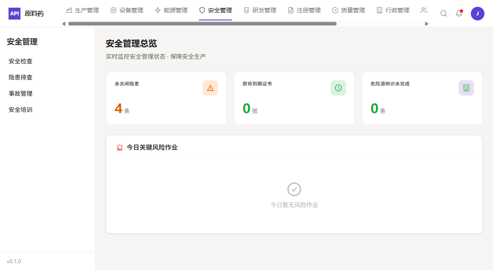

---

## 2. 安全检查

**路由**: `/safety/check`

支持多种检查类型（月度、节前、专项、部门、季节性、周检等）的安全检查管理。功能包括检查计划制定、检查执行记录、问题整改跟踪、检查报告生成。

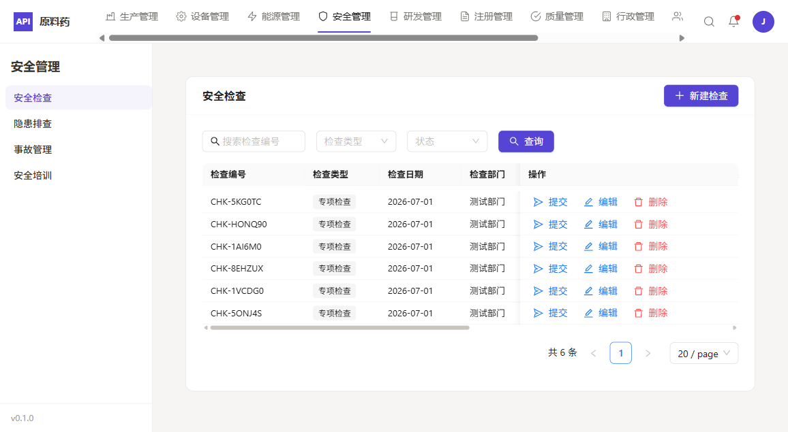

---

## 3. 隐患排查

**路由**: `/safety/hazard`

四步式隐患登记流程（隐患登记 → AI分析 → 确认结果 → 完成）。支持上传隐患图片进行AI智能识别，自动回填隐患分类、级别、整改建议。包含草稿箱功能，支持保存未完成登记。

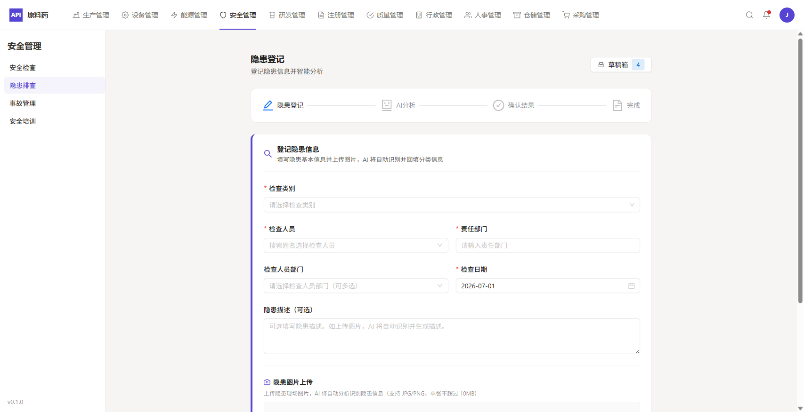

---

## 4. 隐患台账

**路由**: `/safety/hazard-ledger`

隐患台账管理，支持按隐患级别、责任部门、发现日期等多维度筛选。展示隐患编号、描述、级别、状态、整改期限、验收人等完整信息，支持隐患详情查看和整改跟踪。

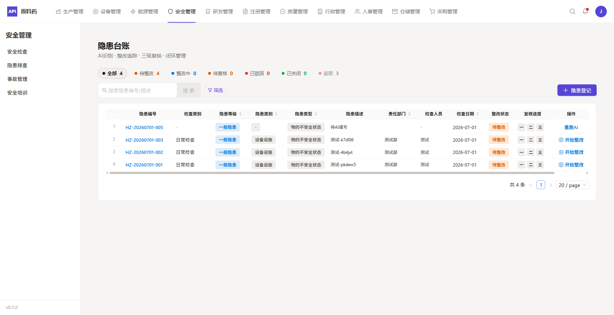

---

## 5. 事故管理

**路由**: `/safety/accident`

安全事故全生命周期管理，从事故报告、调查分析、整改措施（CAPA）到事故关闭的完整流程。支持事故分级、直接原因/根本原因分析、整改任务分配与跟踪。

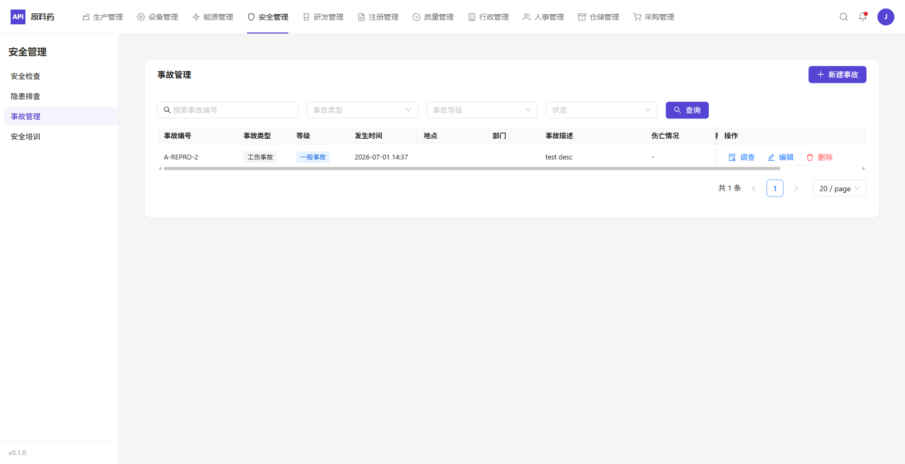

---

## 6. 安全培训

**路由**: `/safety/training`

安全培训记录管理，支持培训计划制定、培训实施记录、培训效果评估、培训档案管理。涵盖新员工三级安全教育、专项安全培训、特种作业人员培训等类型。

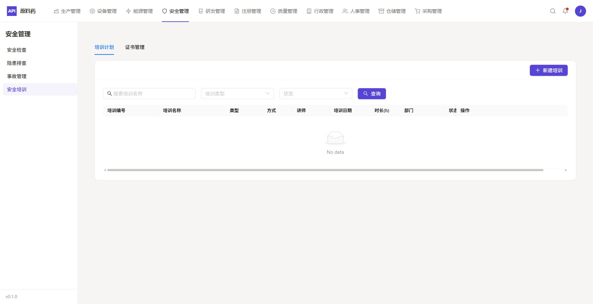

---

## 7. 特殊作业

**路由**: `/safety/special-ops`

八大特殊作业（动火、受限空间、高处、吊装、临时用电、动土、断路、盲板抽堵）的报备与审批管理。支持作业风险等级评估、作业票管理、作业过程监督、作业完成验收。

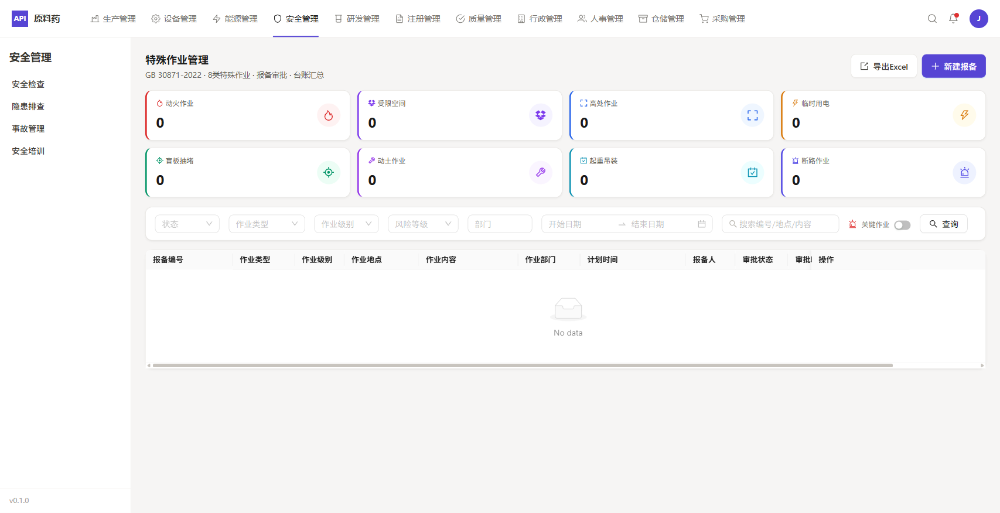

---

## 8. 危险源辨识

**路由**: `/safety/hazard-identification`

危险源辨识与风险评估，支持LEC法风险评价、风险分级管控、辨识台账管理。包含重大危险源识别、风险等级划分、管控措施制定等功能。

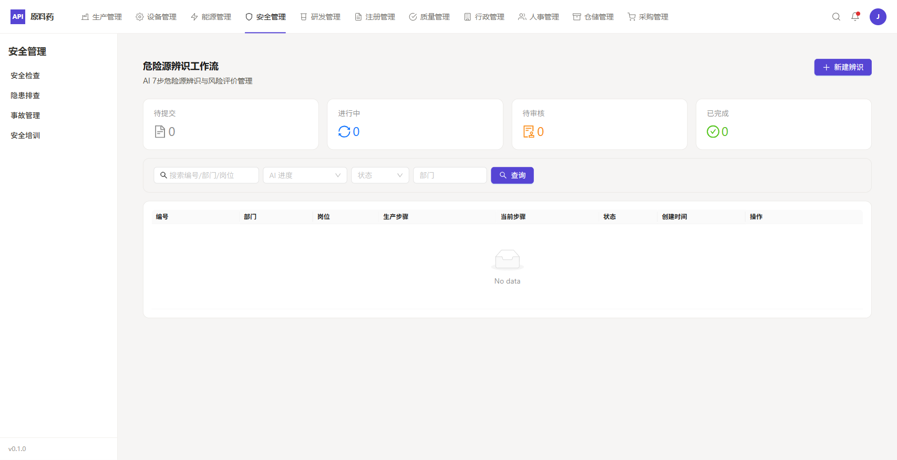

---

## 9. 定时任务

**路由**: `/safety/scheduled-tasks`

安全相关定时任务配置与管理，支持cron表达式设置任务执行周期。可用于定期隐患排查提醒、安全检查计划触发、安全报告自动生成等场景。

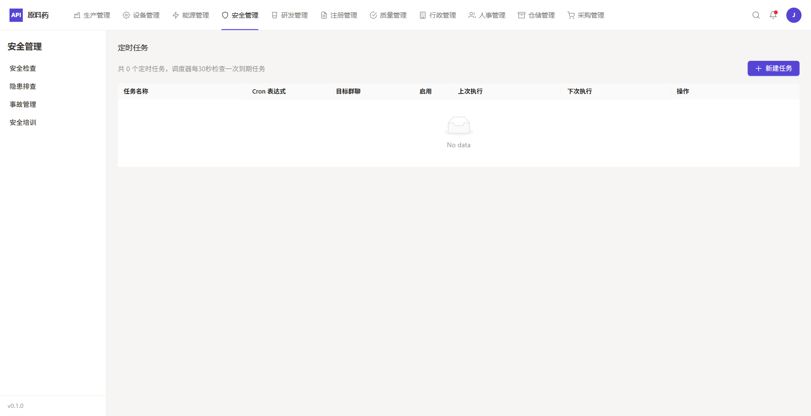

---

## 10. 承包商管理

**路由**: `/safety/contractor`

承包商安全管理，包括承包商准入审核、安全资质管理、入厂安全教育、作业过程监督、安全绩效评价。确保承包商作业符合企业安全管理要求。

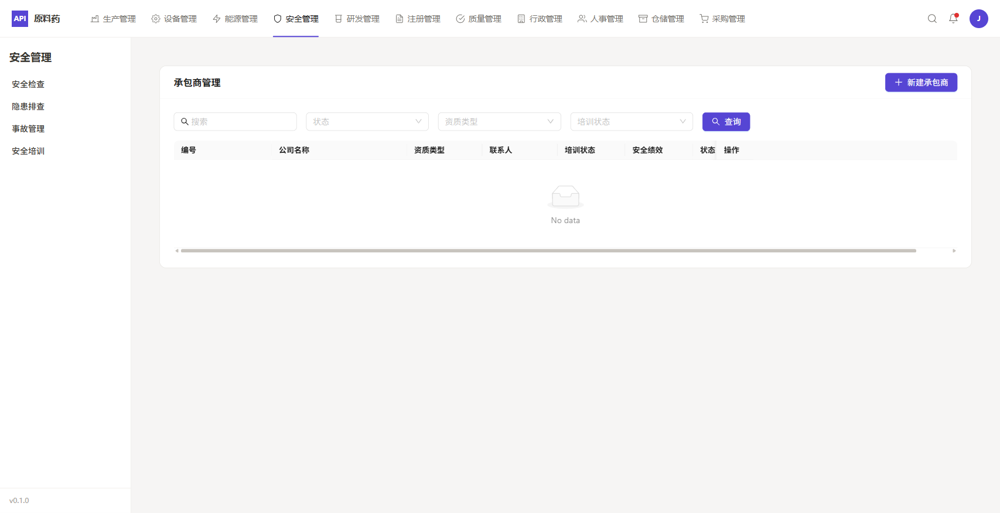

---

## 11. 安全知识库

**路由**: `/safety/knowledge-base`

安全知识文档管理，支持安全操作规程、安全技术标准、事故案例库、法规标准库等分类管理。提供全文检索、文档版本控制、权限管理等功能。

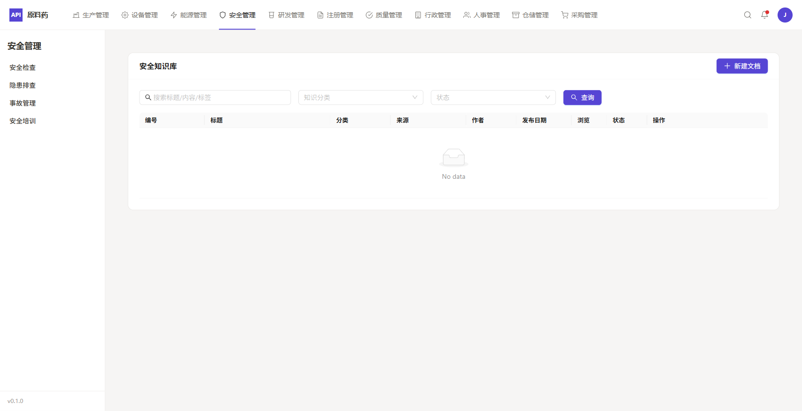

---

## 12. 职业健康

**路由**: `/safety/occupational-health`

职业健康管理，包括职业病危害因素监测、职业健康体检管理、职业病防护设施管理、个人防护用品管理、职业健康档案管理等。

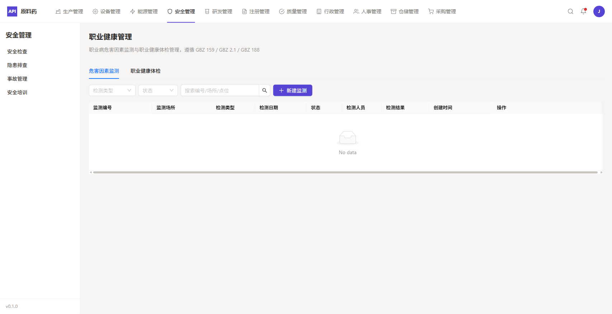

---

## 13. EHS变更

**路由**: `/safety/ehs-change`

EHS变更管理（环境、健康、安全），支持人员变更、工艺变更、设备变更、原材料变更等各类变更的风险评估与管控措施落实跟踪。

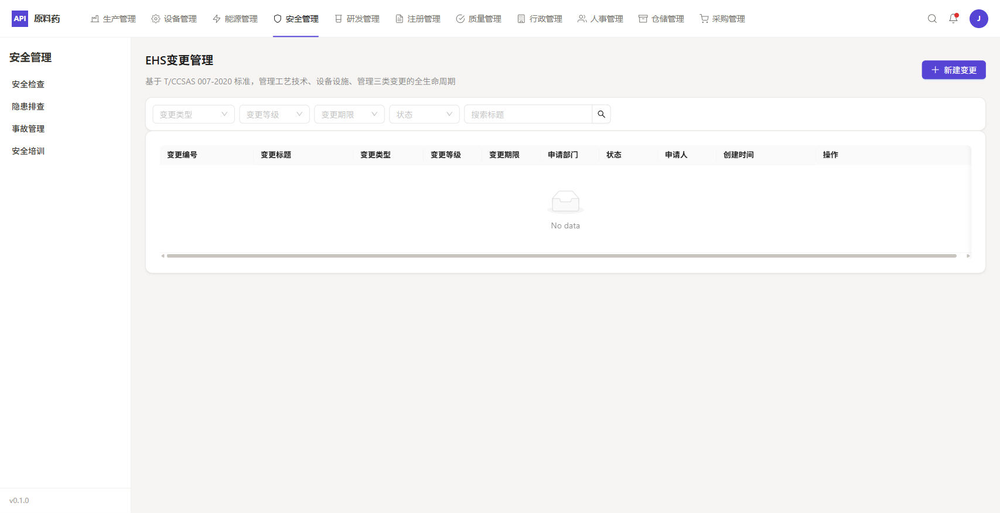

---

## 14. 法规管理

**路由**: `/safety/regulation`

安全生产法规标准管理，支持适用法规识别、法规要求分解、合规性评价、法规更新跟踪。包含法规库、标准库、合规检查表等管理功能。

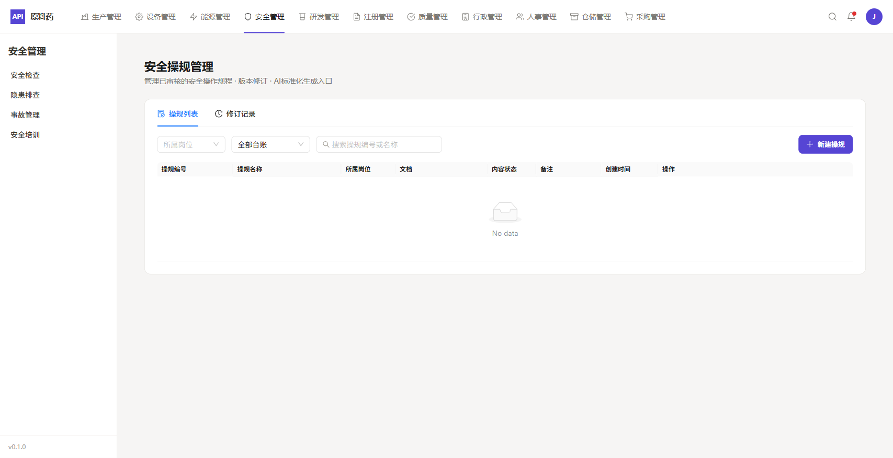

---

## 15. 风险报备

**路由**: `/safety/risk-reporting`

每日关键风险作业报备管理，用于记录和跟踪当天计划进行的高风险作业活动，支持风险等级评估、管控措施确认、作业完成反馈。

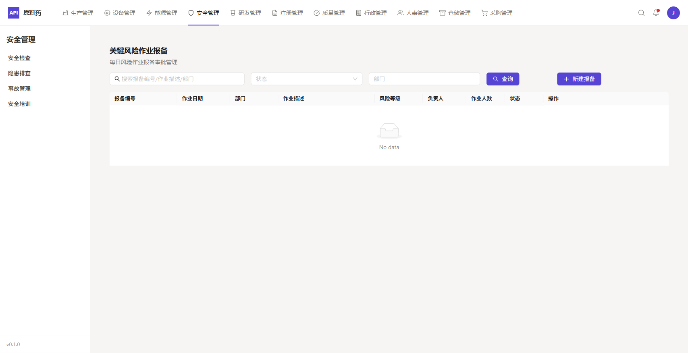

---

## 16. AI工作流配置

**路由**: `/safety/ai-workflow-config`

安全模块AI功能配置，包括隐患AI识别参数配置、危险源AI辨识模型设置、AI分析结果阈值调整等。支持对接DeepSeek/Qwen等AI模型。

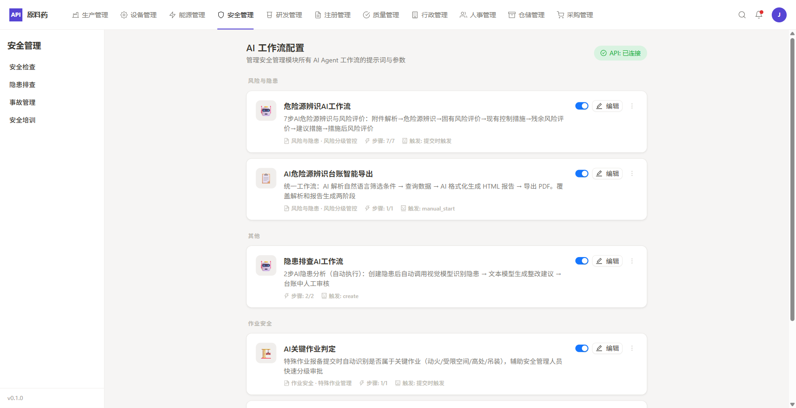

---

## 移植状态汇总

| 功能模块 | 状态 | 截图 |
|---------|------|------|
| 仪表盘首页 | ✅ 已移植 | 01-dashboard.png |
| 安全检查 | ✅ 已移植 | 02-safety-check.png |
| 隐患排查 | ✅ 已移植 | 03-hazard-registration.png |
| 隐患台账 | ✅ 已移植 | 04-hazard-ledger.png |
| 事故管理 | ✅ 已移植 | 05-accident.png |
| 安全培训 | ✅ 已移植 | 06-training.png |
| 特殊作业 | ✅ 已移植 | 07-special-ops.png |
| 危险源辨识 | ✅ 已移植 | 08-hazard-identification.png |
| 定时任务 | ✅ 已移植 | 09-scheduled-tasks.png |
| 承包商管理 | ✅ 已移植 | 10-contractor.png |
| 安全知识库 | ✅ 已移植 | 11-knowledge-base.png |
| 职业健康 | ✅ 已移植 | 12-occupational-health.png |
| EHS变更 | ✅ 已移植 | 13-ehs-change.png |
| 法规管理 | ✅ 已移植 | 14-regulation.png |
| 风险报备 | ✅ 已移植 | 15-risk-reporting.png |
| AI工作流配置 | ✅ 已移植 | 16-ai-workflow-config.png |

**注**: 另有隐患详情页、危险源辨识新建/台账/详情、定时任务新建/详情、法规生成器等动态路由页面已移植但未单独截图展示。

---

## 菜单暴露情况

当前侧边栏菜单仅暴露 **4 个入口**：
- 安全检查 (`/safety/check`)
- 隐患排查 (`/safety/hazard`)
- 事故管理 (`/safety/accident`)
- 安全培训 (`/safety/training`)

其余 **12 个功能模块** 需通过直接输入 URL 访问，或等待后续菜单配置更新。

---

## 后端支持

- **数据库表**: 23 张安全相关表
- **API 路由**: 18 个接口端点
- **AI 集成**: DeepSeek（文本分析）、Qwen（图像识别）
- **飞书集成**: 双向同步（隐患、危险源等数据）

---

*报告生成时间: 2026-07-01*  
*截图工具: Playwright MCP*
